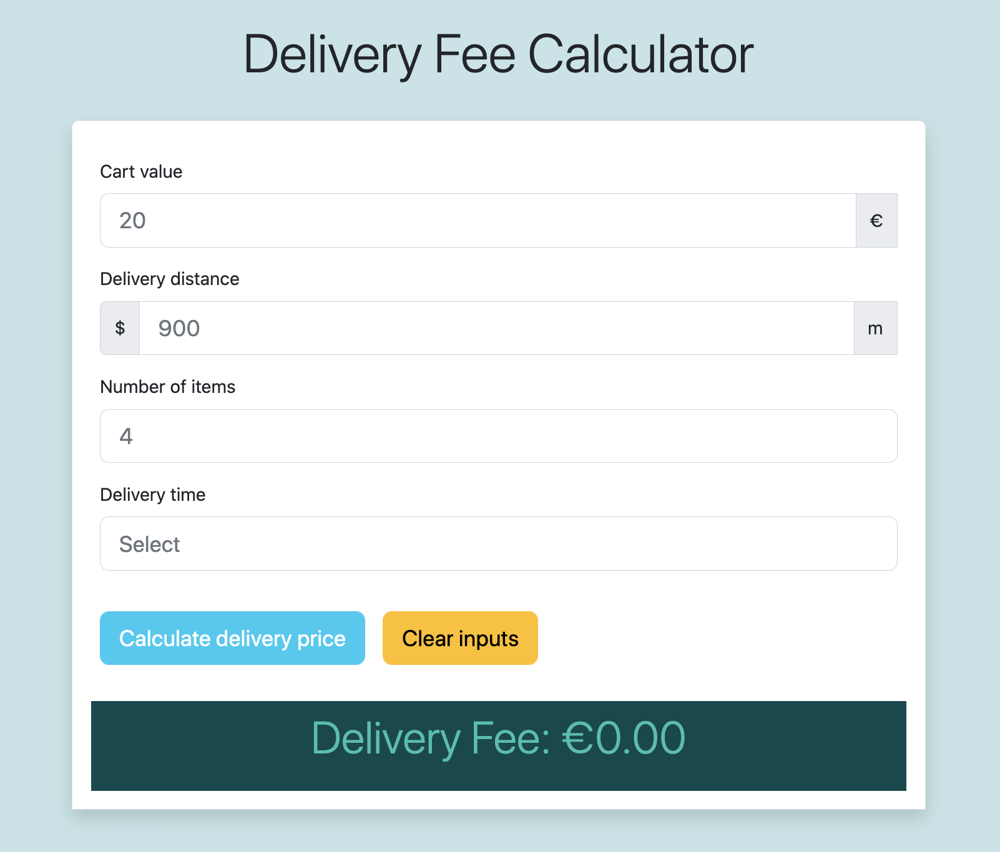

# Delivery Fee Calculator

A web app using React and Typescript that calculates how much the delivery will cost depending on the cart value, the number of items in the cart, the time of the order and the delivery distance.

## Demo

Here is a working live demo: [https://taupe-twilight-1f8214.netlify.app/](https://taupe-twilight-1f8214.netlify.app/)


## Table of contents

- [General info](#general-info)
- [Technologies](#technologies)
- [Installation](#installation)

## General info

A delivery fee calculator app which calculates a delivery fee based on user input and shows the calculated delivery fee to the user.

## Technologies

Project is built with:

- React
- Typescript
- React-hook-form
- Yup
- React-datepicker
- React testing library Jest

## Installation

To run this project, clone and install it locally using npm:

```shell
# Clone this repository
$ git clone

# Go into the repository
$ cd delivery-fee-calculator

# Install dependencies
$ npm install

# Run the app
$ npm start
```

### Simple build for production

```shell
$ npm run build
```

## Testing

Run test normally with the command:

```shell
CI=true npm test
```

## Sources

Wolt summer 2023 Engineering internship pre-assigment:[https://github.com/woltapp/engineering-summer-intern-2023](https://github.com/woltapp/engineering-summer-intern-2023)
